# 1week
스프링 환경을 구축하고, 스프링 환경 구축과 비교한다.

## 할 일 목록
- [x] Github 계정 생성: 기존에 있는 것을 사용
- [] DBeaver Community 설치 및 Connection
- [x] IntelliJ Community 설치
- [x] JDK 설치
  - 기존에 있는 것이 `Oracle OpenJdk 17.0.10`
  - IntelliJ Community를 통해 `Azul 11.`으로 설치
- [x] 스프링 프로젝트 생성 및 MVC 환경 설정 + API PING
- [] datasource와 mybatis 연동

## JDK 설치 방법
1. [Oracle JDK 17 다운로드 링크](https://www.oracle.com/java/technologies/javase/jdk17-archive-downloads.html)에 가서 자신의 OS에 맞는 것을 설치
    - 가장 위에 있는 `17.0.10` 버전을 사용한다.  
    - Windows x64라서 `Windows x64 Compressed Archive`를 다운로드 받는다.
        - Installer라 MSI Installer 통해서 설치해도 된다. 이 경우 아래 1C:\Program Files\Java`로 자동으로 경로가 잡히는 것으로 알고 있다. 
    - 압축을 해제해서 `C:\Program Files\Java`에 압축을 해제한 폴더를 넣는다.
    - 어떤 방식으로 했냐에 따라 파일 이름이 다를 수 있다. 
        - Installer로 설치한 경우 `C:\Program Files\Java\jdk-17`로 표기되는 게 기본 값인 것 같다.
        - 현재 `C:\Program Files\Java\jdk-17.0.10` 이다
2. 환경 변수 설정
    - `시스템 속성 > 고급 > 환경 변수`에서 `시스템 변수 > 새로 만들기`
    - 변수 이름: `JAVA_HOME`, 변수 값: `C:\Program Files\Java\jdk-17.0.10`으로 설정
    - 변수 이름 : `CLASSPATH`, 변수 값: `%JAVA_HOME%lib`으로 설정
    - 시스템 변수의 `Path`라는 변수를 클릭하고 `편집` 클릭
        - `%JAVA_HOME%\bin\`를 추가하고 확인한다.
3. 검사
    - cmd에서 `java -version` 명령어로 버전이 잘 나오는지 확인한다.
    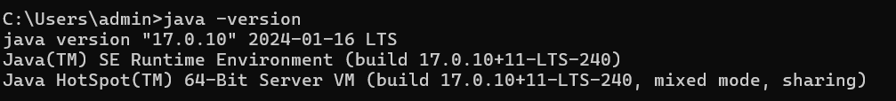

## DBeaver
Debeaver는 데이터베이스 관리 툴로 **여러 데이터베이스를 하나로 관리**할 수 있다.

### DBeaver 사용 이유
- `MySql`, `Postgres` 등 2개 이상의 데이터베이스를 사용하는 경우 `MySQL Workbench`, `PostgreSQL` 등을 설치해 관리 해야 한다.  데이터베이스 종류가 많아지면 데이터베이스에 맞는 여러 툴을 사용하기 복잡한 문제가 생긴다.
- 이를 해결 하기 위해, **하나의 툴로 여러 데이터베이스를 관리**하는 `DBeaver`를 사용한다.

### 설치
1. [DBeaver 다운로드](https://dbeaver.io/download/)에서 자신의 OS 버전에 맞는 것을 설치한다.
    - `Windows (Installer)`를 이용
2. Installer를 실행시킨다.
    - 언어를 설정한다. (추후 인터넷 검색을 위해 영어로 설정)
    - 기본으로 셋팅된 값을 그대로 사용한다. (전부 Next 클릭)

### Connection
1. connection 버튼 클릭
    
    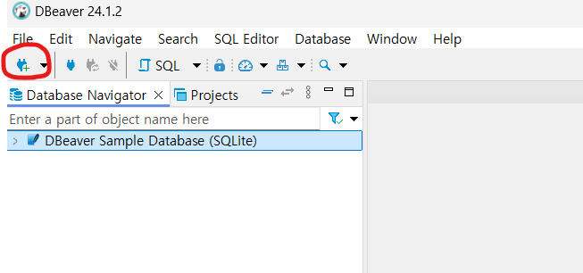
2. DB 선택
     
   
3. 커넥션 정보 입력 및 연결
    - 아래의 `server host`를 자신의 호스트 이름으로 수정한다.
    
   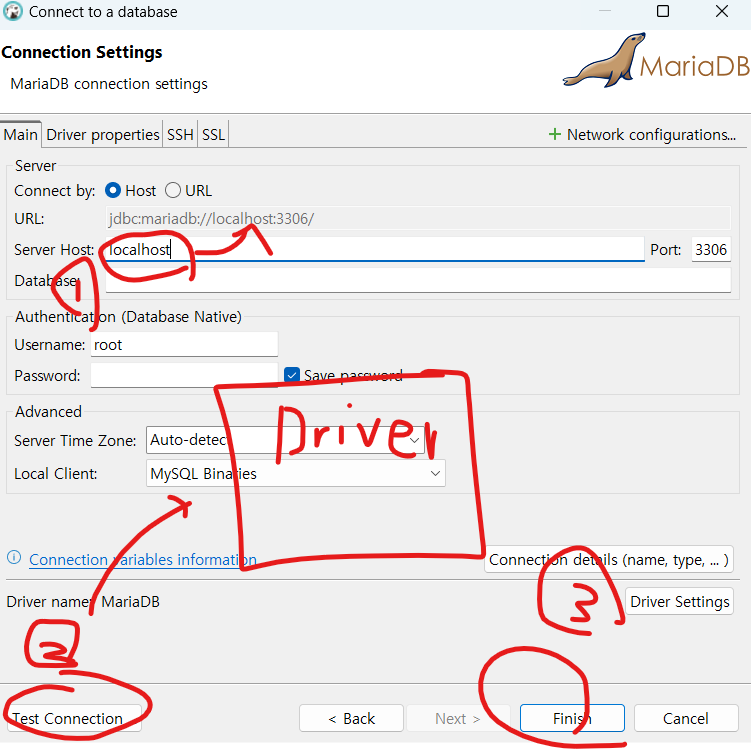

## 스프링 프로젝트 생성 및 MVC 환경 설정 + API PING
### 프로젝트 생성 및 디렉토리 구조 잡기
- `AZulu 11.0.23`의 `web-app` 프로젝트 생성
     
    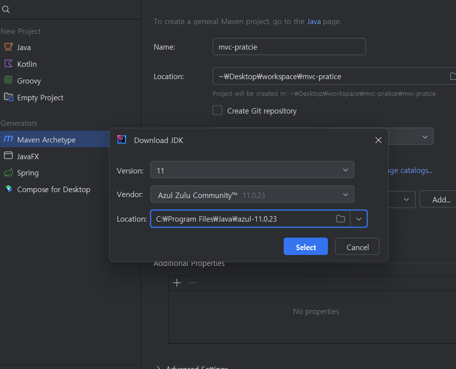
     
    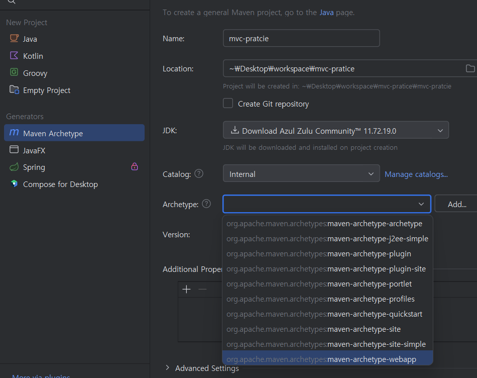
- 디렉토리 구조 잡기
    - java 디렉토리 생성 및 경로 설정
    - 그 하위에 `com.demo.devfun`이란 패키지 생성
    - 패키지 하위에 controller, dto, dao, service 디렉토리 생성
    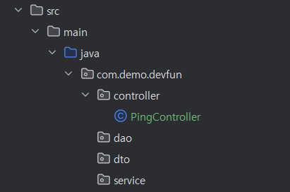

### Dependency & jetty build 추가
- [pom.xml에 dependency와 jetty build 추가 커밋 내역](https://github.com/HwiYul-G/comento-backend-work/commit/02d54f164dc3851b452aef570d6896ba9e7d22a9)

### Spring 설정을 위한 web.xml 수정 및 web 설정
- [web.xml 수정 커밋 내역](https://github.com/HwiYul-G/comento-backend-work/commit/3d57938c1a1b3edb2a20fe893b8fdf0a277d3fad)
- [web 설정 커밋 내역](https://github.com/HwiYul-G/comento-backend-work/commit/9a3bfd9ef61b8f10ce8205f2ec0e56526d7a38c7)

### PingController 작성 및 jetty 실행
#### PingController 작성
- jetty 실행 테스트를 위해서 `PingController` 를 작성한다.
  - 별도의 DB 연결 없이 데이터를 스스로 만들어서 출력하게 함
- [코드 작성 커밋 내역](https://github.com/HwiYul-G/comento-backend-work/commit/91b271afb43c521b2170e596614b6b978851d55b)
#### Jetty 실행 설정
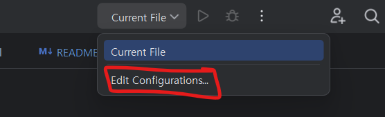
 
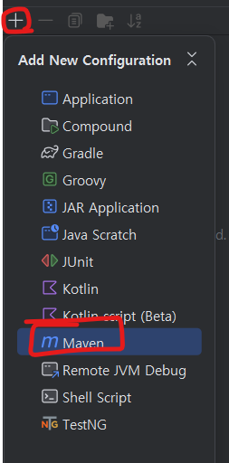
 
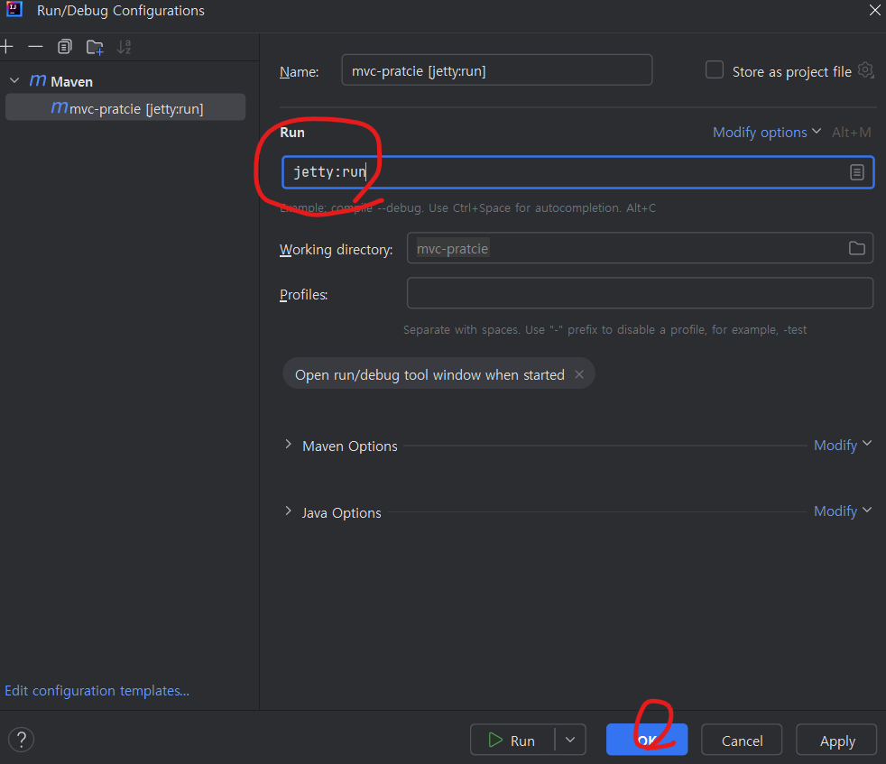

#### 실행 테스트
- `Run` 버튼 클릭 혹은 `Shift + F10` 단축키
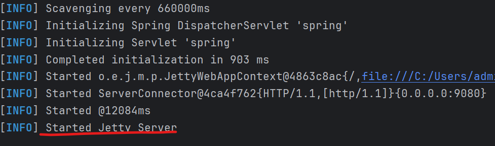
- `localhost:8090/ping`  
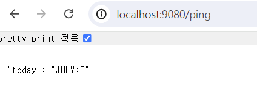

## datasource & mybatis 연동

## 참고 자료
- [JDK 설치 & 환경 변수 설정하기](https://ziszini.tistory.com/103) : 누군가의 블로그인데 이미지가 있어서 글로 나열한 것보다 보기 좋습니다.
- [코멘토 IT 대기업 현업 개발자와 함께하는 백엔드 개발 실무](https://comento.kr/edu/learn/ITSW/IT-G489)에서 나누어 주신 자료들