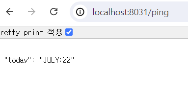
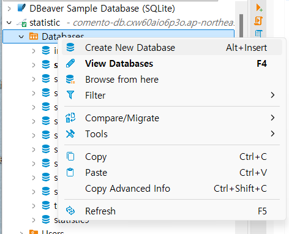
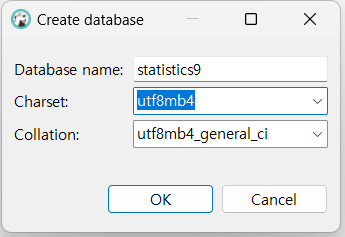
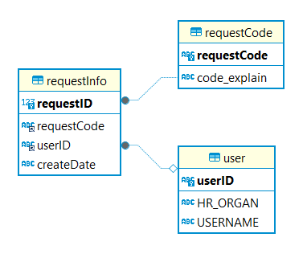
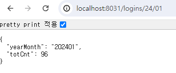

##  스프링 부트 환경 셋팅 및 환경 셋팅 테스트
### 스프링 부트 환경 셋팅
1. [spring initializr](https://start.spring.io/ )에 들어가서 Maven프로젝트 생성
    - GROUP: 프로젝트 그룹의 id
    - Artifcat, Name: 애플리케이션 이름
    - Description: 애플리케이션 설명
    - packageName: 그룹 + artifact id의 조합
    - packaging: Jar
    - Java: 17
    - dependencies
        - lombok: 자바의 보일러 플레이트 코드를 어노테이션 형태로 줄여준다.
        - spring web: RESTful web services와 웹 앱을 만들기 위해 필요한 도구들을 장착
        - spring boot devTools: 파일에 변화가 생길 때 애필리케이션의 재시작을 자동으로 유발한다.
2. 1의 결과로 생성된 프로젝트를 인텔리제이, 이클립스같은 IDE로 오픈한다.
3. 프로젝트 구조 정리
    - `resources` 경로 아래: `mapper`, `static`, `templates` 디렉토리 + `application.properties`
    - `com.demo.comentoStatistic` 경로 아래: `config`, `controller`, `dao`, `dto` 패키지 생성
4. application.properties 설정
```application.properteis
server.port = 8031
server.servlet.contextPath=/  # root 경로 설정 (없으면 기본값이 /)

logging.level.org.springframework.web=DEBUG # DEBUG 레벨 이상의 로그만 보여줌 (TRACE > DEBUG > INFO > WARN > ERROR> FATAL)
logging.level.org.hibernate=ERROR # ERROR 이상의 로그레벨만 보여줌

devtools.livereload.enabled=true # 파일 변화시 reload가 될 수 있도록 설정
```
### 환경 셋팅 테스트
1. `PingController` 만들어서 테스트하기
    - [코드 작성 커밋 내역](https://github.com/HwiYul-G/comento-backend-work/commit/8440ac623d3fd9ea067ebc87ed6a6f47759bbea0)
2. 스프링 구동 후 `http://localhost:8031/ping`에서 데이터 확인

    

## DB와 Table 생성 및 DB 데이터 초기화
1. DBeaver 설치 및 connection
    - [1주차 내역의 DBeaver 설치, Connection 파트 참고]('./1week.md')
2. 새 databse 생성
    |1|2|
    |:--:|:--:|
    |||
3. erd 따라서 sql console로 table 생성

    

    - `spring-boot/sql/create-table.sql`에서 테이블 생성 sql 관리
    - [관련 테이블 생성 sql 바로가기](../spring-boot/sql/create-table.sql)
4. `requestCode` table 데이터 초기화
    - [requestCode 데이터 삽입 sql](../spring-boot/sql/init-requestCode.sql)
5. `user` table 데이터 초기화
    - [user 데이터 삽입 sql](../spring-boot/sql/init-user.sql)
6. `requestInfo` table 데이터 초기화
    - [requestInfo 관련 랜덤 데이터 생성 파이썬 코드](../requestInfo-generator.py)
    - [해당 코드로 생성된 초기화 데이터 sql 파일](../spring-boot/sql/init-requestInfo.sql)    

## 스프링 부트, Mybatis, mariadb 연동
1. mybatis, mariaDB, junit test dependencies 추가
    - [의존성 추가 관련 커밋](https://github.com/HwiYul-G/comento-backend-work/commit/e2cff2f63b196bf605048dd80c3c3e9aa09ab3fb)
2. application.properites 추가
    - [db 설정 및 mybatis-xml 연결](https://github.com/HwiYul-G/comento-backend-work/commit/2cf2806fab6192a7eb946cf24b2b47da38e17c15)
3. mapper 작성
    - [dto, dao 작성 및 mapper와 연결](https://github.com/HwiYul-G/comento-backend-work/commit/f1ca683e151b703abfd962416fabb57fb07f7821)
4. service, controller 작성
    - [서비스](https://github.com/HwiYul-G/comento-backend-work/commit/7bb3324fb8bb62d68115b972ca807e958c415dc1)
    - [controller](https://github.com/HwiYul-G/comento-backend-work/commit/55b6e90011d07f1bebd4d94429974e8ef079bae1)
5. 실행 결과

    

## API sql
1. 년월별 사용자 접속자 수(로그인 수)
    ```sql
    ```
    - 평균 하루 로그인 수
        ```sql
        ```
    - 휴일 제외 로그인 수
        ```sql
        ```
    - 휴일 제외한 평균 하루 로그인 수
        ```sql
        ```
2. 년월별 부서별 사용자 접속자 수(로그인 수)
    ```sql
    ```
3. 년월별 부서별 사용자 접속자 수(로그인 수)
    ```sql
    ```
4. 년월별 게시글 작성 수
    ```sql
    ```
5. 년월별 부서별 게시글 작성 수
    ```sql

    ```